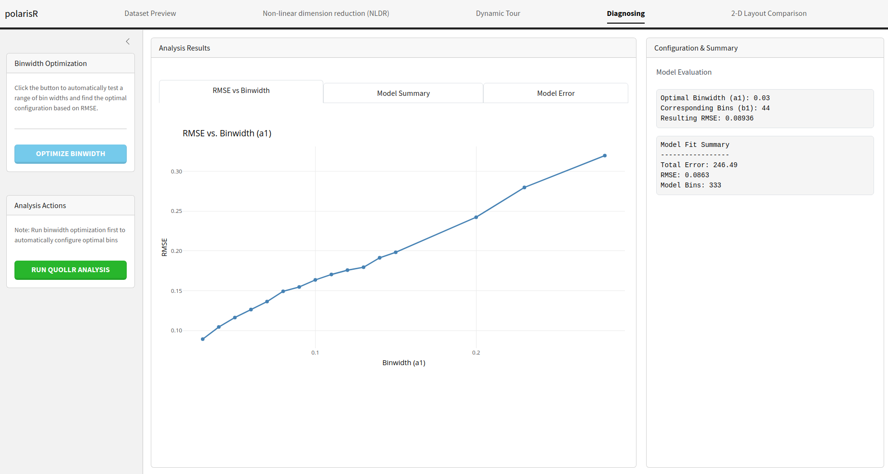

```{r, include = FALSE}
knitr::opts_chunk$set(
  collapse = TRUE,
  comment = "#>"
)
```

```{css, echo=FALSE}
/* Simple, clean typography following universal rules */
body {
  font-size: 16px;
  line-height: 1.6;
  font-family: Georgia, "Times New Roman", serif;
  max-width: 800px;
  margin: 0 auto;
  padding: 1rem;
}

/* Headings with proper hierarchy */
h1, h2, h3, h4, h5, h6 {
  margin-top: 1.5em;
  margin-bottom: 0.5em;
  line-height: 1.2;
}

h1 { font-size: 2em; }
h2 { font-size: 1.5em; }
h3 { font-size: 1.3em; }

/* Paragraph spacing */
p {
  margin-bottom: 1em;
}

/* List spacing */
ul, ol {
  margin-bottom: 1em;
}

li {
  margin-bottom: 0.25em;
}

/* Code blocks */
pre {
  background-color: #f5f5f5;
  padding: 1em;
  border-radius: 4px;
  overflow-x: auto;
  margin: 1em 0;
}

code {
  background-color: #f0f0f0;
  padding: 0.2em 0.4em;
  border-radius: 3px;
  font-family: "Consolas", "Monaco", monospace;
}

/* Images */
img {
  max-width: 100%;
  height: auto;
  margin: 1em 0;
}
```

## Introduction

Welcome to the `polarisR` vignette. This document provides a comprehensive guide to using the `polarisR` interactive application for non-linear dimension reduction (NLDR) analysis. We will walk through each tab of the application, explaining the features and functionalities available to help you explore and understand your high-dimensional data.

<div style="background-color: #f0f8ff; padding: 1.5em; border-radius: 8px; text-align: center; margin: 1em 0;">
<h2 style="margin-top: 0;">What does polarisR stand for?</h2>
<p style="font-size: 1.1em; font-family: monospace; margin-bottom: 0;">
<b>p</b>rojective <b>o</b>utput <b>l</b>ayouts <b>a</b>nd <b>r</b>educed <b>i</b>nteractive <b>s</b>urfaces in <b>R</b>
</p>
</div>

## Installation and Setup

You can install polarisR from GitHub using:

```r
# Install pak if you haven't already
# install.packages("pak")

pak::pak("Divendra2006/polarisR")
```

Alternatively, using devtools:

```r
# Install devtools if you haven't already
# install.packages("devtools")

devtools::install_github("Divendra2006/polarisR")
```

## Getting Started

To launch the polarisR application:

```r
library(polarisR)
run_nldr_viz()
```

This will open the interactive Shiny application in your default web browser.

## Application Overview

The polarisR interface is organized into **five main tabs**, each designed for specific aspects of your data analysis workflow:

1. **Dataset Preview** - Load and explore your data, select columns, and manage datasets
2. **Non-linear dimension reduction (NLDR)** - Apply NLDR methods (t-SNE/UMAP) with parameter configuration and visualization
3. **Dynamic Tour** - Explore high-dimensional structure through animated projections  
4. **Diagnosing** - Assess embedding quality using quantitative methods
5. **2-D Layout Comparison** - Compare different NLDR configurations and results

Each tab builds upon the previous ones, creating a comprehensive workflow from data loading to advanced comparative analysis. Let's explore each tab in detail.

## Dataset Preview Tab

The **Dataset Preview** tab is the starting point of your analysis. Here, you can load your data, select relevant columns, and get a quick overview of your dataset.


### Features:

*   **Upload Dataset:** You can upload your own dataset in CSV format using the "Upload Dataset" button. The application will automatically validate the file and handle potential errors.
*   **Example Datasets:** `polarisR` comes with three pre-loaded datasets: `four_clusters`, `pdfsense`, and `trees`. You can select any of these to explore the application's features without needing your own data.

```r
# Access the datasets directly
data(four_clusters, package = "polarisR")
data(pdfsense, package = "polarisR") 
data(fake_trees, package = "polarisR")

# View dataset information
?four_clusters
?pdfsense
?fake_trees
```

**Dataset Descriptions:**

*   **four_clusters**: A synthetic dataset with four distinct clusters, perfect for testing clustering visualization
*   **pdfsense**: A high-energy physics dataset representing parton distribution function fits
*   **fake_trees**: A high-dimensional tree data structure with 10 branching points

**Additional Features:**

*   **Column Selection:** After loading a dataset, you can choose which columns to include in the NLDR analysis. By default, all columns are selected. You can manually select or deselect columns and apply the changes.
*   **Data Preview:** A table displays the first few rows of your dataset, allowing you to inspect the data and ensure it has been loaded correctly.
*   **Dataset Information:** This section provides a summary of your dataset, including the number of rows, columns, and the types of columns (numeric or categorical).
*   **NLDR Datasets:** As you run different NLDR analyses, the results will be stored and listed here. You can easily switch between different results to compare them.

## Non-linear dimension reduction (NLDR) Tab

The **Non-linear dimension reduction (NLDR)** tab is where the main NLDR analysis happens. You can choose between t-SNE and UMAP, configure their parameters, and visualize the results.


### Features:

*   **Choose Method:** Select either `t-SNE` or `UMAP` as your NLDR method.
*   **t-SNE Parameters:**
    *   **Perplexity:** Adjust the perplexity value, which influences the number of nearest neighbors for each point.
    *   **Max Iterations:** Set the maximum number of iterations for the t-SNE algorithm.
    *   **Auto-adjust perplexity:** Let the application automatically choose a suitable perplexity value based on your data.
*   **UMAP Parameters:**
    *   **Number of Neighbors:** Control the size of the local neighborhood UMAP will use.
    *   **Min. Distance:** Set the minimum distance between embedded points.
*   **Color Options:** Choose a column from your dataset to color the points in the visualization. This is useful for identifying clusters or patterns.
*   **Reproducibility Options:** Set a random seed to ensure that your NLDR results are reproducible.
*   **Run Visualization:** Click this button to start the NLDR computation. The progress will be displayed, and the resulting visualization will be shown on the right.
*   **Visualization Information:** This panel displays the parameters used for the current visualization, making it easy to track your experiments.

## Dynamic Tour Tab

The **Dynamic Tour** tab offers an interactive way to explore the high-dimensional space of your data. It provides a dynamic projection of the data, which can be viewed as a scatter plot, sage plot, or slice plot.


### Features:

*   **Select Tour Display:** Choose from three types of dynamic tours:
    *   **Scatter:** A standard scatter plot of the projected data.
    *   **Sage:** A scatter plot display that adjusts for the projected volume, defined in [Laa et al. (2021)](https://doi.org/10.1080/10618600.2021.1963264).
    *   **Slice:** A scatter plot display that highlights points close to the projection plane, defined in [Laa et al. (2020)](https://doi.org/10.1080/10618600.2020.1777140).
*   **Tour Options:**
    *   **Show Axes:** Toggle the visibility of the axes in the tour plot.
    *   **Show Wireframe:** Toggle the visibility of wireframe edges in the tour plot for enhanced structural visualization.
    *   **Point Opacity (Alpha):** Adjust the transparency of the points.
    *   **Gamma (for Sage):** Control the effective dimensionality parameter for the sage plot.
    *   **Slice Relative Volume (for Slice):** Adjust the thickness of the slice.
*   **Enable Linked Brushing:** When enabled, you can select points in the NLDR plot, and the corresponding points will be highlighted in the dynamic tour plot, and vice-versa. This is a powerful feature for exploring the relationship between the low-dimensional embedding and the original high-dimensional data.

## Diagnosing Tab

The **Diagnosing** tab provides tools to assess the quality of your NLDR embedding. It uses the `quollr` package to perform a quantitative analysis of the embedding and helps you find the optimal parameters for your visualization.

### Features:

*   **Binwidth Optimization:** This feature automatically tests a range of bin widths for the `quollr` analysis and finds the optimal configuration based on the Root Mean Square Error (RMSE).
*   **Run Quollr Analysis:** After optimizing the binwidth, you can run the full `quollr` analysis to get a detailed assessment of your embedding.
*   **Analysis Results:** The results of the analysis are presented in several tabs:
    *   **RMSE vs Binwidth:** An interactive plot showing the RMSE for different binwidth values.
    
    *   **Model Summary:** A table with the detailed results of the binwidth optimization.
    
    *   **Model Error:** A visualization that shows the quality of the model fit, highlighting areas of high and low prediction error.
    
*   **Configuration & Summary:** This section displays the optimal binwidth configuration and a summary of the `quollr` model fit.

## 2-D Layout Comparison Tab

The **2-D Layout Comparison** tab allows you to compare the results of different NLDR analyses. You can compare different methods (t-SNE vs. UMAP) or the same method with different parameters.


### Features:

*   **Choose Comparison Type:**
    *   **NLDR Settings Comparison:** Compare the RMSE of different NLDR configurations. This is useful for finding the best method and parameters for your data.
    
    *   **Side-by-Side Visualization:** Display two NLDR plots next to each other for a direct visual comparison.
    
    *   **Enable Linked Brushing:** In the side-by-side visualization mode, you can enable linked brushing to select points in one plot and see the corresponding points highlighted in the other.
    
*   **Dataset Selection:** Select the NLDR results you want to compare from the list of stored results.
*   **Run Comparison Plot:** Generate the comparison plot based on your selection.
*   **Best Configuration Summary:** When comparing NLDR settings, this section will show you the best configuration found based on the RMSE.

## Tips and Best Practices

### Data Quality Considerations:
*   Ensure sufficient numeric columns for analysis
*   Handle missing values before upload
*   Consider data scaling if variables have very different ranges
*   Minimum 50+ observations recommended for stable NLDR results

## Technical Requirements

*   **R Version**: R >= 4.1.0
*   **Key Dependencies**: shiny, plotly, DT, quollr, Rtsne, umap
*   **Browser**: Modern web browser with JavaScript enabled
*   **Memory**: Sufficient RAM for your dataset size (recommend 4GB+ for large datasets)

## Support

For questions, bug reports, or feature requests, please visit:

*   **GitHub Repository**: https://github.com/Divendra2006/polarisR
*   **Issues**: https://github.com/Divendra2006/polarisR/issues

---

<div style="text-align: center; margin-top: 2em; padding: 1em; background-color: #f8f9fa; border-radius: 5px;">
<p style="margin-bottom: 0.5em; font-weight: bold;">Developed by</p>
<p style="margin-bottom: 0;">Divendra Yadav, Ursula Laa, Jayani P. Gamage, Eun-Kyung Lee</p>
</div>
